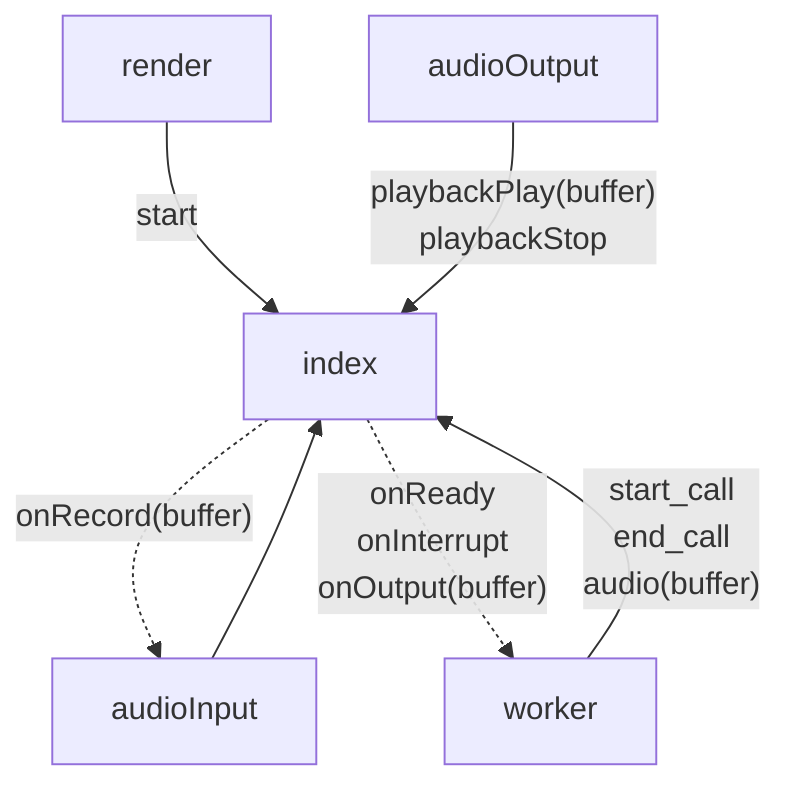
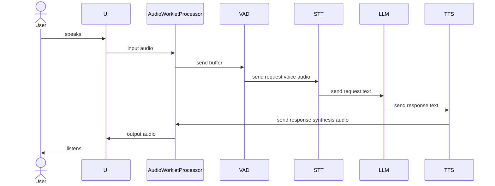

# Echo-Albertina

## About the project

Echo-Albertina is a voice assistant that runs entirely within a web browser, utilizing WebGPU for accelerated computation. It is designed with a 'local-first' approach, meaning all data processing—from voice recognition to response generation—happens on the user's machine. This ensures that conversations remain private and are never sent to an external server.

The application integrates a complete pipeline of AI models to enable conversation. It uses Voice Activity Detection (VAD) to listen for speech, Speech-to-Text (STT) for transcription, a Large Language Model (LLM) for generating responses, and Text-to-Speech (TTS) to vocalize the answer.

Built with the [Transformers.js](https://huggingface.co/docs/transformers.js) library, this project serves as a technical demonstration of running a sophisticated, multi-model AI system on the client-side. All that is required for it to function is a modern web browser that supports the necessary web standards.

https://github.com/user-attachments/assets/a80e8e65-f78f-4827-8ef9-54fb3f7badbf

## Architecture

#### Overview

There are five parts of the application:
1. **Render**: logic of rendering three.js scene and handling user events (mouse clicks, a window resizes).
2. **AudioInput**: logic of catching microphone audio stream via AudioWorkletProcessor.
3. **Worker**: logic for detecting voice activity, transcription, llm, voice synthesis.
4. **AudioOutput**: logic of playing audio stream via AudioWorkletProcessor.
5. **Index**: logic of combining all four parts mentioned above.



#### Process


Firstly, user's audio is recorded by AudioWorkletProcessor.  
The UI renders animation based on audio intensity.  
Also, audio buffer is sent to VAD.  
VAD receives small chunks of data very frequently, here audio is analyzed, and only voice is saved to a bigger chunk.  
Voice chunk is sent to an SST model to transcribe audio to text, which will be sent to LLM.  
The next step is receiving a response from LLM, a text is sent to a TTS model to generate audio.  
Audio is returned to AudioWorkletProcessor to play in the browser.  
This process can be interrupted if a new voice chunk is detected by VAD.  
Finally, the UI renders animation based on audio intensity.


## Project setup
#### Quick start
```
git clone https://github.com/vault-developer/albertina
cd albertina
npm i
npm run dev
```
_Note: ~2.5GB of data will be downloaded by the browser._

#### How to download models
There are two ways of downloading and storing models:

| Pros                                           | Browser's cache | /public folder |
|------------------------------------------------|-----------------|----------------|
| zero configuration                             | +               | -              |
| models will NOT be wiped out after cache reset | -               | +              |
| advanced custom configuration                  | -               | +              |
| easy to deploy to production env               | +               | -              |

You can use some models from `/public` folder and others from browser's cache.  
The logic is configurable in `MainProcessor.loadModels()` method.  
If you choose to use browser's cache — no actions are required.  
Otherwise, please download models and store them like in the example here:
```
public/
└── models/
    ├── vad/
    │   └── silero-vad/
    │       ├── config.json
    │       ├── onnx-config.json
    │       ├── preprocessor_config.json
    │       ├── tokenizer_config.json
    │       └── onnx/
    │           └── model.onnx
    ├── llm/
    │   └── smollm2-1,7b-instruct/
    │       ├── config.json
    │       ├── generation_config.json
    │       ├── special_tokens_map.json
    │       ├── tokenizer.json
    │       ├── tokenizer_config.json
    │       └── onnx/
    │           └── model_q4f16.onnx
    ├── stt/
    │   └── whisper-base/
    │       ├── config.json
    │       ├── generation_config.json
    │       ├── preprocessor_config.json
    │       ├── tokenizer.json
    │       ├── tokenizer_config.json
    │       └── onnx/
    │           ├── decoder_model_merged.onnx
    │           └── encoder_model.onnx
    └── tts/
        └── kokoro-82m-v1.0-onnx/
            ├── config.json
            ├── tokenizer.json
            ├── tokenizer_config.json
            ├── onnx/
            │   └── model.onnx 
            └── voices/
                ├── voice-1.bin
                ├── voice-2.bin
                └── voice-3.bin
    
```
After that, `MainProcessor.loadModels()` implementation should be updated with new paths to the models.   
You can find examples in `src/worker/main/constants.ts`.

#### Model examples to download from huggingface:
| Name    | Type | ModelId                               | Local                               |
|---------|------|---------------------------------------|-------------------------------------|
| Silero  | VAD  | `xnohat/silero-vad`                   | `/models/vad/silero-vad`            |
| Kokoro  | TTS  | `onnx-community/Kokoro-82M-v1.0-ONNX` | `/models/tts/kokoro-82m-v1.0-onnx`  |
| Whisper | STT  | `onnx-community/whisper-base`         | `/models/stt/whisper-base`          |
| SmolLm  | LLM  | `HuggingFaceTB/SmolLM2-1.7B-Instruct` | `/models/llm/smollm2-1,7b-instruct` |

## Contribution:
If you want to contribute, feel free to fork this repository and create a pull request.  
Have a question or idea? Feel free to raise it in our discussions session 👍  

## Credits
The worker logic is inspired by [this transformers.js example](https://github.com/huggingface/transformers.js-examples/blob/main/conversational-webgpu).  
The three.js scene code is partially reused from [audiovisualizer by WaelYasmina](https://github.com/WaelYasmina/audiovisualizer/tree/main#).
